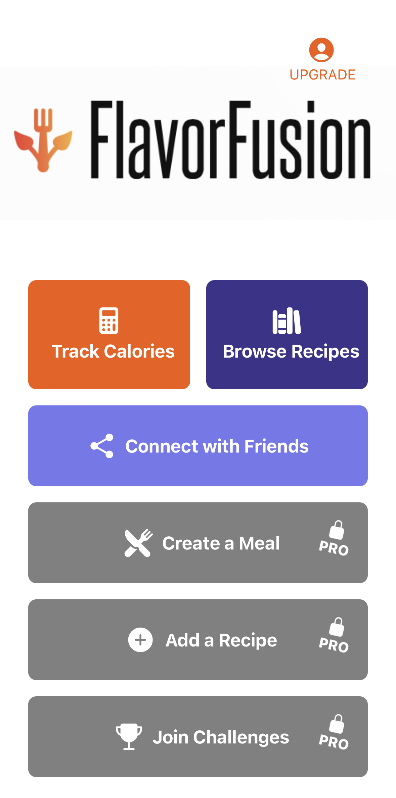
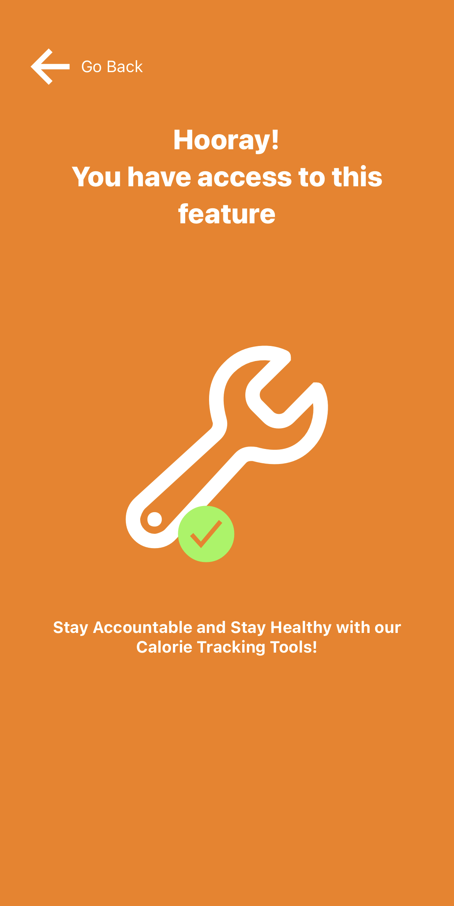
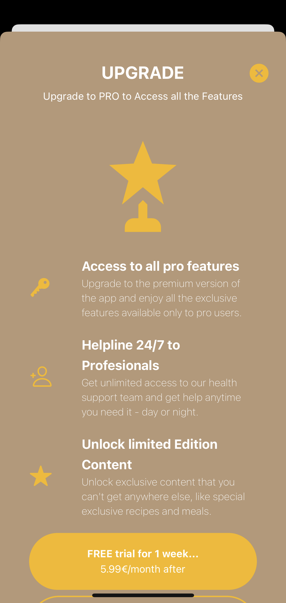
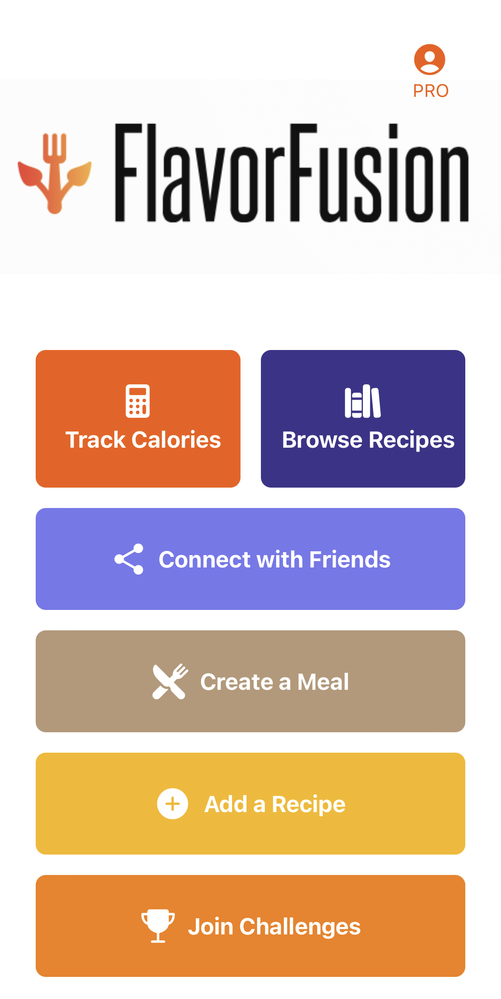

# Subscription - Health App

The subscription page is a part of the Health App built with React Native. It allows users to view and manage their subscription plans and upgrade to a pro membership.

## Screenshots

  
  
  
  

## Features

- The PaywallScreen imports the necessary components, icons, and the useRevenueCat hook for handling subscription-related logic.
- It retrieves the current offering from the useRevenueCat hook.
- The UI is rendered based on the availability of the current offering.
- If the current offering is not available, an activity indicator is displayed.
- If the current offering is available, the UI presents the subscription details and options.
- Users can upgrade to a pro membership by selecting either the monthly or annual subscription options.

## Acknowledgements

- [YouTube: Subscriptions with React Native](https://www.youtube.com/watch?v=bE6eyZcU89U&t=3526s) by [Sonny Sangha]: The subscription page was created based on this video tutorial. We would like to express our gratitude to the author/channel for providing valuable guidance and resources.

